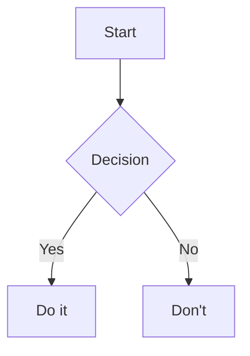

# Rich Content Rendering (Mermaid + KaTeX)

## Overview

Add two missing content types to NoteLiner's markdown pipeline:

1. **Mermaid diagrams** — fenced code blocks tagged `mermaid` render as SVG (flowcharts, sequence diagrams, gantt charts, etc.).
2. **KaTeX math** — inline `$x^2$` and display `$$\int_0^1 f(x)\,dx$$` render as typeset math.

Both render consistently across all four output surfaces: **Preview pane**, **History pane preview**, **HTML export**, and **PDF export**. A user who writes a technical note with a system diagram and some equations gets identical output whether they're reading it in-app, reading a historical commit, sharing the HTML, or printing to PDF.

## Current State

- **Preview:** `Preview.svelte:49` renders with `marked(editorContent)` → `{@html html}`. No extensions installed.
- **History:** `HistoryPanel.svelte` uses the same pattern for historical commits.
- **HTML export:** `main.js:424` — `marked(mdContent)` wrapped in an inline-styled template, written to `~/Downloads/<slug>.html`.
- **PDF export:** `main.js:463` — same template, rendered in a hidden `BrowserWindow`, then `printToPDF()`. Attachment paths already get rewritten to `file://` URLs (`main.js:470-473`).
- **Theme coupling:** `themeState.current` tracks the active theme id; Dark/Midnight/Dark-Purple are dark, Light/Light-Purple are light.
- **Dependencies:** `marked@^15.0.0` already installed. `mermaid` and `katex` are new.

## Design

### Libraries

- **`marked-katex-extension`** — official `marked` extension for KaTeX. Works identically in renderer and main process (no DOM dependency for rendering).
- **`mermaid`** (v10+) — browser-only; requires a DOM. Runs fine in renderer and in the hidden `BrowserWindow` used for PDF export, but cannot run directly in the main process for HTML export.
- **`katex`** — core CSS (`katex.min.css`) must ship with exported HTML.

### Architecture decision: where does each library run?

| Surface | KaTeX | Mermaid |
|---|---|---|
| Preview pane (renderer) | `marked.use(katex())` at module load, then `{@html}` | Post-render: `mermaid.run({ nodes: pre > code.language-mermaid })` |
| History pane preview | Same as Preview | Same as Preview |
| HTML export | `marked.use(katex())` in main process, inline `katex.min.css` | Inline `mermaid.min.js` with auto-init `<script>` — renders client-side when the user opens the HTML |
| PDF export | Same as HTML | Render in the existing hidden `BrowserWindow`, wait for `mermaid.run()` to complete, THEN `printToPDF` |

This keeps the pipeline simple: KaTeX is pure-text (server-renderable), Mermaid always needs a browser but we already spin one up for PDF. For HTML export, we accept "opens-in-browser" rendering — the exported HTML is self-contained and offline-capable if we bundle the Mermaid JS inline.

**Alternative considered and rejected:** render Mermaid to SVG server-side using `puppeteer` or a headless browser. Adds ~300MB of dependency for marginal benefit — the BrowserWindow approach for PDF already gives us pre-rendered output, and for HTML letting the viewer render is fine.

### Theme awareness

Mermaid supports a `theme` config: `default | dark | forest | neutral | base`. Map:

```js
function mermaidTheme() {
  const dark = ['midnight', 'dark', 'darkPurple'].includes(themeState.current);
  return dark ? 'dark' : 'default';
}

mermaid.initialize({ startOnLoad: false, theme: mermaidTheme(), securityLevel: 'strict' });
```

KaTeX doesn't have a theme — it renders as SVG/HTML with inherited foreground color, which is what we want. It just needs the theme's `--text-primary` color to be applied to the math output, which happens automatically via CSS cascade.

For **exports**, always render with `theme: 'default'` regardless of app theme — the exported file is meant to be read outside the app, usually on white paper or a white browser page. This is a deliberate choice, not a bug; document it.

### Security

- **KaTeX:** set `throwOnError: false, strict: 'warn'` so a malformed formula renders as red literal text instead of breaking the page or throwing.
- **Mermaid:** set `securityLevel: 'strict'` — disables HTML in labels, prevents click-handlers, sandboxes diagram output. NoteLiner is a local-first app, but a user could paste malicious Mermaid from anywhere.
- **Export HTML:** the inlined `mermaid.min.js` runs on-load in the recipient's browser. This is no more dangerous than any HTML file — but we should document that exported HTMLs contain executable JavaScript, unlike pre-this-feature where they were static.

### Content size implications

Inlining `mermaid.min.js` (~3MB minified) into HTML export makes exports much larger than they were. Options:

1. **Always inline** — self-contained, offline-capable, ~3MB baseline.
2. **CDN reference** — `<script src="https://cdn.jsdelivr.net/npm/mermaid/dist/mermaid.min.js">` — small file, needs internet on open.
3. **Conditional inline** — only embed Mermaid if the document actually contains a `mermaid` code block.

Ship option (3). A prose-only note exports at its current size; a diagram-heavy note pays the ~3MB tax only when needed. KaTeX CSS is small (~20KB) and always useful if the doc has math — same conditional inlining.

## Implementation Steps

### Step 1: Dependencies

```
npm install marked-katex-extension katex mermaid
```

Verify the bundled size impact on the Electron renderer build. `mermaid` is code-split-friendly — ensure Vite lazy-loads it in the renderer (we don't want all users paying for Mermaid in every session).

### Step 2: Shared render helper

**New file:** `src/renderer/lib/markdown-render.js`

Centralizes the "render markdown with KaTeX + Mermaid" logic so Preview and History don't duplicate it.

```js
import { marked } from 'marked';
import markedKatex from 'marked-katex-extension';

let katexInstalled = false;
function installKatex() {
  if (katexInstalled) return;
  marked.use(markedKatex({ throwOnError: false, strict: 'warn' }));
  katexInstalled = true;
}

export function renderMarkdown(src) {
  installKatex();
  return marked(src);
}

let mermaidPromise = null;
async function loadMermaid() {
  if (!mermaidPromise) {
    mermaidPromise = import('mermaid').then(m => {
      m.default.initialize({ startOnLoad: false, theme: currentMermaidTheme(), securityLevel: 'strict' });
      return m.default;
    });
  }
  return mermaidPromise;
}

export async function renderMermaidInNode(rootEl) {
  const blocks = rootEl.querySelectorAll('pre > code.language-mermaid');
  if (!blocks.length) return;
  const mermaid = await loadMermaid();
  for (const code of blocks) {
    const pre = code.parentElement;
    const src = code.textContent;
    const container = document.createElement('div');
    container.className = 'mermaid-diagram';
    pre.replaceWith(container);
    try {
      const { svg } = await mermaid.render(`mermaid-${Date.now()}-${Math.random()}`, src);
      container.innerHTML = svg;
    } catch (err) {
      container.innerHTML = `<div class="mermaid-error">Mermaid error: ${escapeHtml(err.message)}</div>`;
    }
  }
}

function currentMermaidTheme() {
  const dark = ['midnight', 'dark', 'darkPurple'].includes(themeState.current);
  return dark ? 'dark' : 'default';
}
```

### Step 3: Preview.svelte integration

Replace the current inline `marked()` call with the shared helper, and run Mermaid post-render.

```svelte
<script>
  import { renderMarkdown, renderMermaidInNode } from '../lib/markdown-render.js';
  import { themeState } from '../stores/theme.svelte.js';

  let html = $derived(renderMarkdown(resolveAttachmentUrls(projectState.editorContent || '')));

  $effect(() => {
    html; themeState.current;  // re-run when either changes
    if (previewContentEl) renderMermaidInNode(previewContentEl);
  });
</script>

<link rel="stylesheet" href="../node_modules/katex/dist/katex.min.css">
```

The `<link>` to KaTeX CSS lives in the main HTML or in a top-level Svelte component so it loads once. Alternatively, import `'katex/dist/katex.min.css'` via Vite so it's bundled.

### Step 4: HistoryPanel.svelte integration

Same pattern as Preview. Because history previews render stored commit content, wikilinks and other extensions all behave consistently.

### Step 5: HTML export handler

**`src/main/main.js`** — `file:convertToHtml`:

```js
const { marked } = require('marked');
const markedKatex = require('marked-katex-extension');
const fs = require('fs');
const path = require('path');

const katexCss = fs.readFileSync(
  path.join(__dirname, '..', '..', 'node_modules', 'katex', 'dist', 'katex.min.css'),
  'utf-8'
);
const mermaidJs = fs.readFileSync(
  path.join(__dirname, '..', '..', 'node_modules', 'mermaid', 'dist', 'mermaid.min.js'),
  'utf-8'
);

marked.use(markedKatex({ throwOnError: false }));

ipcMain.handle('file:convertToHtml', async (_event, filename, name) => {
  if (!projectService.projectPath) return null;
  const mdContent = fs.readFileSync(path.join(projectService.projectPath, filename), 'utf-8');
  const htmlBody = marked(mdContent);

  const hasMath = /\\begin\{|[^\\]\$/.test(mdContent);
  const hasMermaid = /```mermaid/.test(mdContent);

  const extraHead = `
    ${hasMath ? `<style>${katexCss}</style>` : ''}
    ${hasMermaid ? `<script>${mermaidJs}</script><script>mermaid.initialize({ startOnLoad: false, theme: 'default', securityLevel: 'strict' });</script>` : ''}
  `;

  const extraBodyScript = hasMermaid ? `
    <script>
      document.querySelectorAll('pre > code.language-mermaid').forEach(async (code, i) => {
        const { svg } = await mermaid.render('m'+i, code.textContent);
        const div = document.createElement('div');
        div.innerHTML = svg;
        code.parentElement.replaceWith(div);
      });
    </script>` : '';

  const fullHtml = `<!DOCTYPE html>
<html lang="en">
<head>
  <meta charset="utf-8">
  <title>${name}</title>
  <style>/* ... existing styles ... */</style>
  ${extraHead}
</head>
<body>
  <h1>${name}</h1>
  ${htmlBody}
  ${extraBodyScript}
</body>
</html>`;

  // ... existing file write logic
});
```

### Step 6: PDF export handler

**`src/main/main.js`** — `file:convertToPdf`:

The existing flow already spins up a hidden `BrowserWindow`, loads data-URL HTML, and calls `printToPDF`. We extend it:

1. Build the HTML with embedded Mermaid (like Step 5 above).
2. After `loadURL`, wait for Mermaid rendering to complete before calling `printToPDF`. The cleanest mechanism: have the injected script set `document.body.dataset.mermaidDone = 'true'` when finished, and poll via `executeJavaScript` or use `webContents.once('did-finish-load')` plus a `waitForExpression` helper.

```js
await pdfWindow.loadURL('data:text/html;charset=utf-8,' + encodeURIComponent(fullHtml));
if (hasMermaid) {
  await pdfWindow.webContents.executeJavaScript(`
    new Promise(resolve => {
      const check = () => {
        if (document.body.dataset.mermaidDone === 'true') resolve();
        else setTimeout(check, 50);
      };
      check();
    });
  `);
}
const pdfData = await pdfWindow.webContents.printToPDF({ ... });
```

Modify the embedded script so its final line sets `document.body.dataset.mermaidDone = 'true'`.

### Step 7: Styling

Add to `src/renderer/styles/global.css`:

```css
.mermaid-diagram { display: flex; justify-content: center; margin: 16px 0; }
.mermaid-diagram svg { max-width: 100%; height: auto; }
.mermaid-error { color: #d33; font-family: monospace; white-space: pre-wrap; padding: 12px; background: var(--bg-overlay); border-radius: 6px; }

/* KaTeX inherits text color by default; just ensure block math is centered */
.katex-display { margin: 1em 0; overflow-x: auto; }
```

## Edge Cases

- **Dollar signs as currency:** `$5 and $10` currently gets mis-parsed by KaTeX as inline math. `marked-katex-extension` handles this with `nonStandard: false` requiring `\$` escaping — document in the help/About modal, or switch to non-standard mode which is more forgiving but less Pandoc-compatible. V1: standard mode, document the escape rule.
- **Mermaid inside blockquote or list:** works — the selector `pre > code.language-mermaid` matches regardless of nesting.
- **Invalid Mermaid syntax:** the `catch` block in `renderMermaidInNode` displays the parser error inline in red. Users see *why* their diagram failed.
- **Mermaid theme change at runtime:** the `$effect` re-runs on `themeState.current` change, re-rendering all diagrams with the new theme.
- **Historical content with math/Mermaid on History pane:** works identically — same render helper. Useful for seeing how a diagram changed across commits.
- **PDF pagination of tall Mermaid SVGs:** `printToPDF` doesn't split SVGs cleanly. If a diagram is taller than a page, it gets clipped. V1 accepts this; a V2 could add `page-break-inside: avoid; max-height: 9in;` CSS and scale oversized diagrams.

## Testing

Create a "smoke test" note containing:

````markdown
# Smoke Test

## Math
Inline: $E = mc^2$

Display:
$$
\int_0^\infty e^{-x^2}\,dx = \frac{\sqrt{\pi}}{2}
$$

## Diagram


## Invalid Mermaid
```mermaid
not valid syntax
```
````

Verify each block renders correctly in:
1. Preview pane (light theme).
2. Preview pane (dark theme) — Mermaid theme switches.
3. History pane preview (after committing).
4. HTML export — open in browser, verify math and diagram render.
5. PDF export — open the PDF, verify math and diagram are rasterized into the file.
6. Invalid Mermaid block shows an inline error message, does not break other blocks.

## Rollout

No schema change, no settings to migrate. Users who don't use math or diagrams see zero change. Users who do get the rendering for free after upgrading.

One user-facing note: the first PR/commit of this feature should mention in the release notes that HTML exports now embed JavaScript when the source has Mermaid diagrams. Power users with auditing/security concerns may want to know.

## Out of Scope (V1)

- **PlantUML / Graphviz / Excalidraw** — extend the same pattern if demand arises.
- **Live Mermaid preview while typing** — would require re-rendering on every keystroke. Save-driven preview is enough.
- **Math macros / custom KaTeX commands** — users can put `\newcommand` at the top of a note and it works within that note. Global macros are out of scope.
- **SVG/PNG export of individual diagrams** — would need a separate "Export diagram" affordance in the Preview context menu. Nice to have, not essential.
